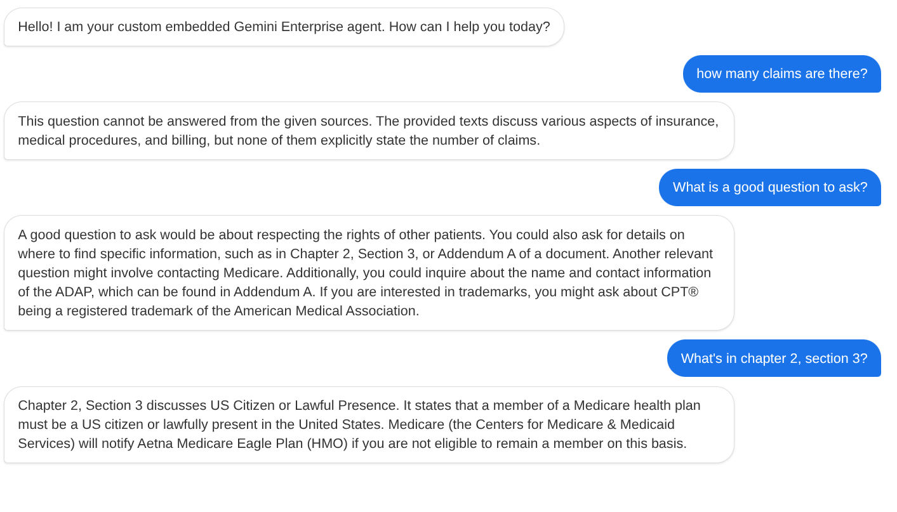

# Gemini Enterprise Custom Embed

A lightweight, secure proxy service and frontend chat interface that allows you to embed your private Gemini Enterprise (Vertex AI Search) agents directly into your custom applications. 

## Overview

Unlike standard Looker embedding or public web widgets, the Google Cloud Console strictly prohibits embedding its native UI in an `iframe` (via `X-Frame-Options` and CSPs) for security and clickjacking prevention. Furthermore, securely handling user authentication entirely within an iframe for enterprise data can be problematic.

This project solves those limitations by acting as a **secure middleman**:
1. **FastAPI Backend:** Uses the `google-cloud-discoveryengine` Python SDK to interact with your Gemini Enterprise Agent/Data Store via a securely configured Service Account.
2. **Vanilla HTML/JS Frontend:** Serves a clean, customizable chat interface that you can easily embed in your main application using a standard `<iframe>`.

End-users never need to log into Google Cloud or interact with raw API keys; your backend proxy handles the security while providing a seamless chat experience.

## Demo



## Prerequisites

1.  **Python 3.12+**
2.  A Google Cloud Project with **Vertex AI Search and Conversation** enabled.
3.  A Service Account with appropriate permissions (`roles/discoveryengine.admin` or `roles/discoveryengine.viewer`).
4.  An existing **Data Store** that has the Large Language Model add-on enabled (Conversational Search).

## Configuration

Copy the provided `.env.template` to `.env` at the root of the directory:

```bash
cp .env.template .env
```

Then, open `.env` and configure the following Google Cloud parameters:

```env
# Your GCP Project ID and Number
GCP_PROJECT_ID=your-project-id
GCP_PROJECT_NUMBER=1234567890

# The region your Data Store is located in (e.g., 'global', 'us', 'eu')
GCP_REGION=global

# The ID of your Data Store
GEMINI_DATA_STORE_ID=your-data-store-id

# Path to the JSON key of your service account
SERVICE_ACCOUNT_KEY_FILE=/path/to/your/service_account.json
```

## Running the Application

1. Activate your virtual environment:
   ```bash
   source .venv/python3.12/bin/activate
   ```
2. Install dependencies (if not already installed):
   ```bash
   pip install -r requirements.txt
   ```
3. Start the FastAPI server:
   ```bash
   python app.py
   ```

The application will start on `http://localhost:8000`.

## Embedding

Once the server is running, you can easily embed the chat interface into any other web application using a simple iframe:

```html
<iframe 
    src="http://localhost:8000" 
    style="width: 100%; height: 600px; border: none; border-radius: 8px; box-shadow: 0 4px 6px rgba(0,0,0,0.1);"
    title="Gemini Enterprise Private Embed">
</iframe>
```

## How it works (The API)

The proxy establishes a `/api/chat` endpoint on the backend. When a user sends a message on the frontend, it posts the query and automatically manages the `conversation_id` payload to maintain the chat history session directly with the Vertex AI Search `ConverseConversation` API.